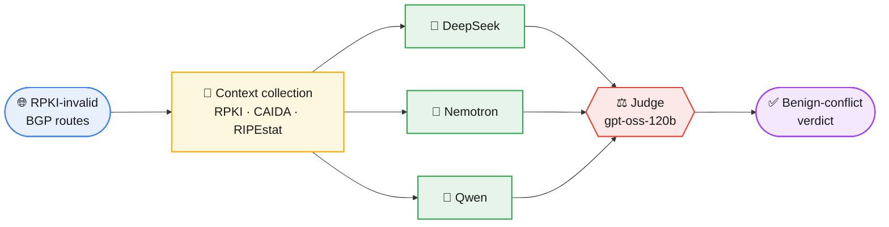

# LLMOV

LLMOV uses large language models to automatically analyze and explain RPKI-invalid BGP routes, with a particular focus on **benign conflicts** — RPKI-invalid announcements that stem from operator misconfiguration between closely related ASes rather than a genuine hijack.

For each RPKI-invalid route, LLMOV assigns a **benign likelihood level** (`Low` / `Medium` / `High`) based on the relationship between the announcement's origin AS and the AS authorized in the covering ROA, and surfaces a **possible root cause** (e.g. prefix transfer, upstream/downstream announcement, traffic engineering) to support mitigation at the source.

## How it works

1. **Context collection.** For a given `(prefix, origin_AS, timestamp)`, the pipeline gathers RPKI validation output, CAIDA AS-relationship data, and RIPEstat prefix/ASN data (geolocation, WHOIS/IRR, routing status, transfer history).
2. **Three independent classifiers.** The same context is sent to three different LLMs, each acting as a single classifier: DeepSeek-R1-Distill-Llama-70B, Llama-3.1-Nemotron-70B-Instruct-HF, and Qwen2.5-72B-Instruct. Each returns a benign-level verdict, an explanation, a possible root cause, and contributing factors as JSON, written to its own CSV.
3. **Judge / aggregation.** `llm_aggregator.py` groups the three classifiers' verdicts for the same route and sends them to a fourth, larger model (`openai/gpt-oss-120b`) acting as judge. The judge reconciles disagreement, merges explanations, unions the contributing factors, and emits one consolidated verdict plus a short `justification` label.

## Architecture



## Repository structure

| File | Role |
|---|---|
| `llm_classifier_deepseek.py` | Single classifier using `deepseek-ai/DeepSeek-R1-Distill-Llama-70B` |
| `llm_classifier_nvidia.py` | Single classifier using `nvidia/Llama-3.1-Nemotron-70B-Instruct-HF` |
| `llm_classifier_qwen.py` | Single classifier using `Qwen/Qwen2.5-72B-Instruct` |
| `llm_aggregator.py` | Judge/aggregator using `openai/gpt-oss-120b`; reconciles the three classifiers' verdicts per route |
| `deepseek_agent.py` / `nvidia_agent.py` / `chatopenai_agent.py` | Thin OpenAI-compatible client wrappers, one per classifier, all pointed at a local model server |
| `gemini_agent.py` | Optional Gemini client (not used by the classifiers by default) |
| `rpki_validator.py` | Queries a local RPKI relying-party validator (Routinator) for route validity and ROA VRPs |
| `get_caida_data.py` / `as_relationship.py` | Loads/queries CAIDA AS-relationship data (`caida.db`) and classifies the origin↔ROA-AS relationship (customer/provider/peer) |
| `process_htmls.py` | Fetches RIPEstat prefix/ASN data (geolocation, WHOIS/IRR, routing status, transfer history) |
| `preload_RIPEstat_data.py` | Loads/saves the RIPEstat JSON cache used by the classifiers |
| `load_ihr_hegemony.py` | Optional IHR Hegemony (AS dependency) lookup, currently disabled in the classifiers |
| `shaman_data_process_lib.py` | Extracts the RPKI-invalid route set from the input hijack dataset |
| `fix_json_str.py` | Extracts and parses the JSON object an LLM returns, with a `json_repair` fallback for malformed output |
| `shaman/real_hijacks_2024.csv` | Input dataset of BGP hijack/misconfiguration events |
| `caida.db` | CAIDA AS-relationships Serial-2 dataset (SQLite), regenerable via `get_caida_data.py` |
| `cache/` | RIPEstat prefix/ASN response cache (populated on first run) |

## Requirements

**Services expected to be running locally:**
- An OpenAI-compatible model server (e.g. vLLM) at `http://localhost:8000/v1`, serving all four models: `deepseek-ai/DeepSeek-R1-Distill-Llama-70B`, `nvidia/Llama-3.1-Nemotron-70B-Instruct-HF`, `Qwen/Qwen2.5-72B-Instruct`, `openai/gpt-oss-120b`.
- A Routinator (or compatible RPKI relying-party) instance exposing its validity API at `http://127.0.0.1:8323`.

**Python packages:**
```
requests
beautifulsoup4
openai
langchain-openai
google-generativeai
json_repair
```

## Usage

### 1. Run the three single classifiers

```bash
python3 llm_classifier_deepseek.py
python3 llm_classifier_nvidia.py
python3 llm_classifier_qwen.py
```

Each writes JSON-per-route results to `./new_results/origin_conflicts/2024/<label>_reasoning_origin_conflicting_routes.txt` (CSV format).

### 2. Aggregate with the judge model

```bash
python3 llm_aggregator.py \
  --inputs ./new_results/origin_conflicts/2024/deepseek-ai_reasoning_origin_conflicting_routes.txt \
           ./new_results/origin_conflicts/2024/nvidia_reasoning_origin_conflicting_routes.txt \
           ./new_results/origin_conflicts/2024/qwen_reasoning_origin_conflicting_routes.txt \
  --provider openai --api-key EMPTY --output aggregated_output.csv
```

## Output schema

Each classifier emits, per route:

```json
{
  "prefix": "string",
  "AS_path": "string",
  "origin_AS": "string",
  "authorized_ASes_in_ROAs": "string",
  "benign_level": "High | Medium | Low",
  "explanation": "string",
  "possible_reason": "string",
  "factors": ["string"]
}
```

The aggregator adds one field, `justification` — a short label such as `same organization`, `strong relationship`, or `no relationship` — to the same schema.

## Known limitations

- The aggregator groups verdicts by `(prefix, origin_AS)`. If the same `(prefix, origin_AS)` pair is re-announced at different times, the classifier CSVs currently have no timestamp column to distinguish those events, so they'd be treated as one.
- `caida.db` (~59 MB) is committed directly to the repo, above GitHub's 50 MB soft warning threshold. Consider Git LFS, or regenerating it locally via `get_caida_data.py`, if it needs to be refreshed often.
- `gemini_agent.py` and `load_ihr_hegemony.py` are present but not currently used by the three classifiers (`hege_data` is hardcoded to `None`).
